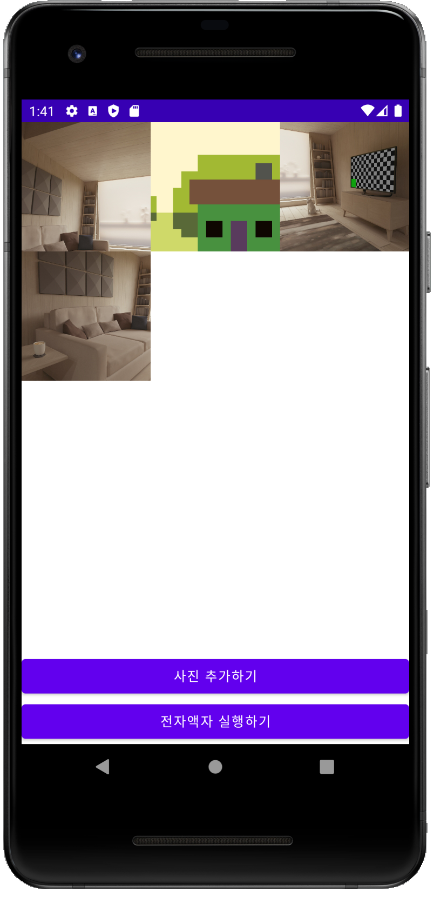

# Android Clone Coding Project #5 전자액자
저장소 접근 권한을 이용하여 로컬 사진을 로드 할 수 있음.
 
추가한 사진들을 일정한 간격으로 전환하여 보여줄 수 있음.
 
# 결과화면
|Screenshot1|Screenshot2|
|---|---|
|||
|||
 
# 배운 내용 정리

- **Layout** 을 그리는 법
  - 가로 화면으로 그리기
- **Android Permission** 사용하기
- **View Animation** 사용하기
- **Activity Lifecycle** 알아보기
  - https://developer.android.com/guide/components/activities/activity-lifecycle?hl=ko
- Content Provider
  - SAF (Storage Access Framework)
